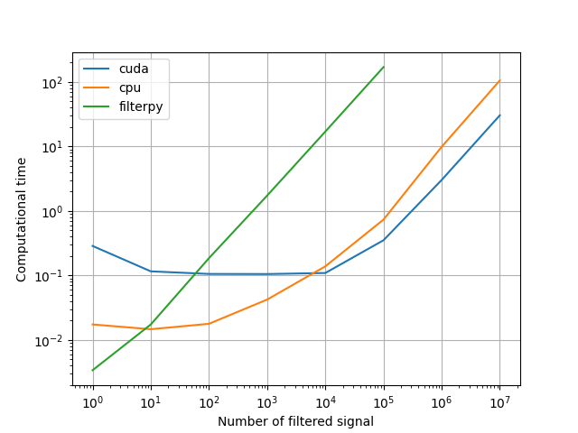

# torch-kf

[](https://github.com/raphaelreme/torch-kf/actions/workflows/tests.yml)

PyTorch implementation of Kalman filters. It supports filtering of batch of signals, runs on gpu (supported by PyTorch) or multiple cpus.

This is based on rlabbe's [filterpy](https://github.com/rlabbe/filterpy) and [interactive book](https://github.com/rlabbe/Kalman-and-Bayesian-Filters-in-Python/) on kalman filters. Currently only traditional Kalman filters are implemented without any smoothing.

This implementation is designed for use-cases with multiple signals to filter. By construction, the Kalman filter computations are sequentials and cannot be parallelize, and usually involve quite small matrices (for physic-based system, the state is usually restricted to less than 10 dimensions), which cannot benefits from gpu/cpus parallelization. This is not true when there are multiples signals to filter in // (or multiple filters to run in //), which happens quite often.

`torch-kf` natively supports batch computations of Kalman filters (no need to loop on your batch of signals). Moreover, thanks to PyTorch, it distributes the computations automatically on your cpus, or is able to run on gpu. It is therefore much faster (**up to 1000 time faster**) when batch of signals are involved. If you have less than 10 signals to filter, [filterpy](https://github.com/rlabbe/filterpy) will still by faster (up to 10 times faster for a single signal) because PyTorch has a huge overhead when small matrices are involved.

This implementation is quite simple but not so much user friendly for people not familiar with PyTorch (or numpy) broadcasting rules. We highly recommend that you read about broadcasting before trying to use this library.

> [!WARNING]
> torch-kf is running by default in float32 and is implemented with the fastest but not the more stable numerical scheme.
> We did not face any real issue yet, but if this becomes an issue, you can enforce using float64 and use `joseph_update=True`.

## Install

### Pip

```bash
$ pip install torch-kf
```

### Conda

Not yet available


## Getting started

```python

import torch
from torch_kf import KalmanFilter, GaussianState

# Some noisy_data to filter
# 1000 timesteps, 100 signals, 2D and an additional dimension to have vertical vectors (required for correct matmult)
noisy_data = torch.randn(1000, 100, 2, 1)

# Create a Kalman Filter (for instance a constant velocity filter) (See example or rlabbe's book)
F = torch.tensor([  # x_{t+1} = x_{t} + v_{t} * dt     (dt = 1)
    [1, 0, 1, 0.],
    [0, 1, 0, 1],
    [0, 0, 1, 0],
    [0, 0, 0, 1],
])
Q = torch.eye(4) * 1.5 **2  # 1.5 std on both pos and velocity (See examples or rlabee's book to build a better Q)
H = torch.tensor([  # Only x and y are measured
    [1, 0, 0, 0.],
    [0, 1, 0, 0],
])
R = torch.eye(2) * 3**2

kf = KalmanFilter(F, H, Q, R)

# Create an inital belief for each signal
# For instance let's start from 0 pos and 0 vel with a huge uncertainty
state = GaussianState(
    torch.zeros(100, 4, 1),  # Shape (100, 4, 1)
    torch.eye(4)[None].expand(100, 4, 4) * 150**2,  # Shape (100, 4, 4)
)

# And let's filter and save our signals all at once
# Store the state (x, y, dx, dy) for each element in the batch and each time
filtered_data = torch.empty((1000, 100, 4, 1))

for t, measure in enumerate(noisy_data):  # Update first and then predict in this case
    # Update with measure at time t
    state = kf.update(state, measure)

    # Save state at time t
    filtered_data[t] = state.mean

    # Predict for t + 1
    state = kf.predict(state)

# Alternatively you can use the already implemented filter method:
states = kf.filter(state, noisy_data, update_first=True, return_all=True)
# states.mean: (1000, 100, 4, 1)
# states.covariance: (1000, 100, 4, 4)

# And optionnally smooth the data (not online: all data should already be available and collected) using RTS smoothing
smoothed = kf.rts_smooth(states)
# smoothed.mean: (1000, 100, 4, 1)
# smoothed.covariance: (1000, 100, 4, 4)

```

## Examples

We provide simple examples of constant velocity kalman filter (1d, 2d, ...) in the `example` folder using batch of signals.

For instance, if system is a sinusoidal function with noisy measurement we can filter and smooth the data using kalman filters. Here is such an example with `nan` measurements in the middle of the filtering process:


We also benchmark our implementation to check when it is faster than filterpy. On a laptop with pretty good cpus and a GPU (a bit rusty), we have typically these performances:



One can see that both cpus and gpu version have a large overhead when the batch is small. But they may lead to a 200x (and 500x for gpu) speed up or more when numerous signals are filtered together.


## Contribute

Please feel free to open a PR or an issue at any time.

Many variants of Kalman filtering/smoothing are still missing and the documentation is pretty poor, in comparison [filterpy](https://github.com/rlabbe/filterpy) is a much more complete library and may give some ideas of what is missing.

<!-- ## Cite Us

This library has initially developped for multiple particle tracking in biology. If you find this library useful and use it in your own research, please cite us:
 -->

